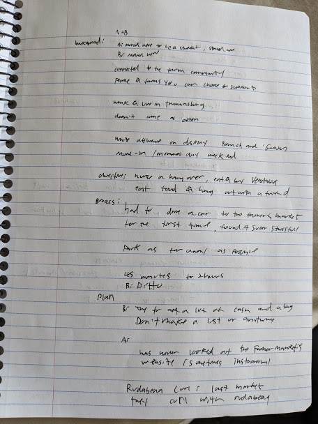
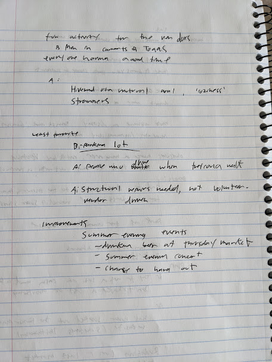

Interviewer Name(s): Zoe (Interviewer) Nick (note-taker)
Interviewee demographics (age, profession): Two Adults in their mid 20’s, both locals to the Ithaca area (one Ithaca, the other Trumansburg NY). One works as a bartender in Trumansburg, the other works as a farmer near Ithaca and often works as a part-time vendor at the Farmer's market. Both are former Cornell sudents but one grew up in Ithaca and the other has moved here permanenetly.

Note: To keep participants anonymous the bartender from Trumansburg will be named 'A' and the Ithaca local will be named 'B'

If at the Farmers Market, ask about experience today (Y)

How often do you visit the Farmers Market?
- In the past, A had been able to go every few weeks. Since they started a new job in a different town, they haven't had many weekend days off.
- B used to work regularly as a vendor for various local farms, but they still try and make it out on their own 'once in a while'

Can you walk us through your gameplan for the Farmers Market?
- Neither seems to make much of a 'gameplan'
- They both enjoy discovering new things on their own, not really having a set list of items to get

How do you get there?
- A has apparently never driven to the farmer's market before today
- B mostly bikes down. If they drive they try and park as far away as possible

What's the first thing you do when you arrive?
- They go up to familiar vendors, strike up conversation, socialize with friends etc

What and how did you purchase items?
- They both typically bring a large amount of cash, kowing a lot of the vendors don't take credit cards
- A talks about how getting cash tips at work helps her have cash for the market

How was the purchasing experience?
- No comments

Who did you interact with or meet at the market, and how did you plan this if applicable?
- Meeting/interacting with people

Was there any special event you came for or discovered (i.e. musician)?
- Later, they talked about something called the 'Rutabaga Curl'

How long did you stay?
- From about 45 minutes to 2 hours

How did you originally find out about the Farmers Market?

How did you plan your visit?
- No
- B doesn't 'make a list or anything'
- A has never looked at the farmer's market website

Who did you go with, if anyone?
- Friends, mainly

Why did you go to (or why are you at) the Farmers Market?
- A: 'a combination of groceries and getting to talk to people I know who work here'

What's your favorite part of the Farmers Market?
- A: The rutabaga curl. On the last day of the Market (in December?) When it gets cold out, all the vendors start playing a game of curling with heads of rutabaga. Its supposed to be a really fun way to de-stress and relax.

What's your least favorite part of the Farmers Market?
- A: "Cornell students just here for brunch and for the 'gram"
- B: Crowds of families not actually interested in buying anything

Raw Notes

