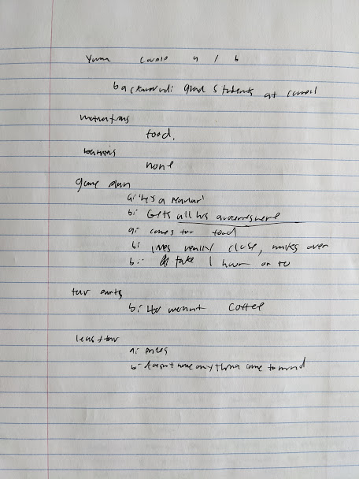

Interviewer Name(s): Zoe (Interviewer) Nick (note-taker)
Interviewee demographics (age, profession): Two Cornell Grad students in their early 20s, one male, one female. The male grad student is apparently studying engineering and the female grad student is studying statistics

If at the Farmers Market, ask about experience today (Y)

How often do you visit the Farmers Market?
- (Male) Once a week, he comes over to get groceries

Can you walk us through your gameplan for the Farmers Market?

How do you get there?
- Transportation
- (male) He apparently lives really close and just walks over, doesn't worry about transportation
- (female) Takes the bus down

What's the first thing you do when you arrive?
- Navigating Vendors
What and how did you purchase items?
- Used cash to buy groceries mostly

How was the purchasing experience?
- (male) "Fine"

How long did you stay?

How did you originally find out about the Farmers Market?
- (female) Heard about it from other grad students at Cornell

How did you plan your visit?
- (male) mostly just comes up with a list of groceries he needs for the week

Who did you go with, if anyone?
- (male) typicaly goes alone

Why did you go to (or why are you at) the Farmers Market?
- (male) Groceries, basically once a week

What's your favorite part of the Farmers Market?
- (female) The food
- (male) 40 weight coffee

What's your least favorite part of the Farmers Market?
 -  Neither had much of a response

Raw Notes

