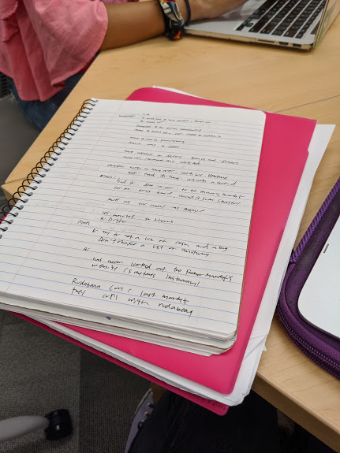
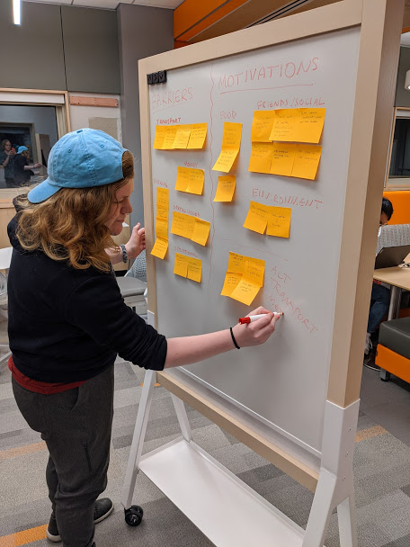
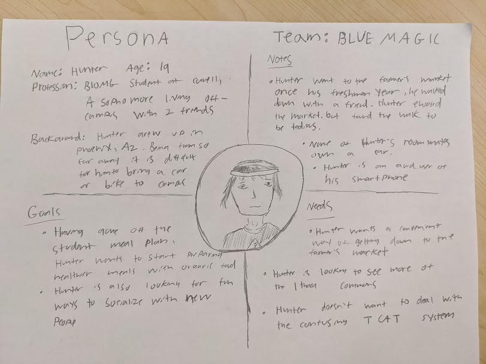

# Blue Magic: Milestone 2

## Information Gathering

This group utilized a series of contextual interviews and casual forms of design ethnography to understand peoples’ process of getting to and experiencing the Ithaca farmer’s market. Specifically, our group used a structure interview procedure to obtain data from our users. Before interviewing, we all contributed to a document that contained a series of questions in which we crafted to best discover various problems and key information.

## Interview Process

Contextual interviews occurred at the Ithaca Farmers Market and on Cornell’s campus. Interviews typically had one note taker and one interviewer or one interviewer taking notes simultaneously. We did 10 interviews collectively.

An example of interview jottings can be seen below

## Interview Summary

#### Interview 1

- Interviewer: Zoe R
- Note Taker: Nick M
- Participants: Two Adults in their mid 20’s, both locals to the Ithaca area (one Ithaca, the other Trumansburg NY)
- Interview Notes: [here](interviews/farmers.md)
- Key motivations: community engagement/supporting local farmers
- Key barriers: living too far away, annoying when busy

#### Interview 2

- Interviewer: Neha R
- Participant: Senior Cornell student
- Interview Notes: [here](interviews/caroline.md)
- Key motivations: wanted to see what the hype was all about
- Key barriers: transportation, not knowing what was there

#### Interview 3

- Interviewer: Zoe R
- Note Taker: Nick M
- Participants: Two Adults in their mid 20’s, both Cornell Grad Students, one male one female
- Interview Notes: [here](interviews/grad-students.md)
- Key motivations: getting groceries
- Key barriers: none

#### Interview 4

- Interviewer: Joe M
- Participants: Senior cornell student
- Interview Notes: [here](interviews/andrew.md)
- Key motivations: Going with friends
- Key barriers: Lack of transportation

#### Interview 5

- Interviewer: Joe M
- Participants: Senior cornell student
- Interview Notes: [here](interviews/elsa.md)
- Key motivations: good pictures and food
- Key barriers: money, time

#### Interview 6

- Interviewer: Viri G
- Participant: 42 year-old Cornell employee
- Interview notes: [here](interviews/keith.md)
- Key motivations: Vegetables/ Produce
- Key barriers: None

#### Interview 7

- Interviewer: Viri G
- Participant: 30 year old Cornell employee
- Interview notes: [here](interviews/hugh.md)
- Key motivations: Fresh food
- Key barriers: Parking, traffic

#### Interview 8

- Interviewer: Nick M
- Note Taker: Zoe R
- Interview notes: [here](interviews/acapella-girls.md)
- Participants: Four Ithaca College undergrad students in a capella group, came to perform
- Key motivations: singing for performance, food, ambiance, occasional fun thing to do
- Key barriers: transit and driving, need car and even so hard to find parking

#### Interview 9

- Interviewer: Zoe R
- Participant: Senior Cornell student who lives on campus
- Interview notes: [here](interviews/sophie.md)
- Key motivations: Events, friends want to go
- Key barriers: Expensive, cash only

#### Interview 10

- Interviewer: Nick M
- Note Taker: Zoe R
- Participant: Cornell agriculture student
- Interview notes: [here](interviews/ag-student.md)
- Key motivations: Works here, family runs farm, getting food
- Key barriers: Nothing really

### Executive Summary

Based on these 10 interviews we realized that the main motivations amongst all our participants included food, friends, and the environment. We also realized that the main barriers/ painpoints of the experience include transportation, busyness, and not fully aware what the market includes. We also want to mention that another similarity we found was that most of our participants did not plan out their trip ahead of time. We documented this better in our affinity diagram.

## Affinity Diagramming

We first wrote down important takeaways from our interviews and arranged them onto a board into categories of barriers, motivations, and miscellaneous
[Sticky Notes](m-2_images/m2-initial-diagram.JPG)

We then organized these information into categories to get a better idea of the patterns found between interviews.

- [Overall Diagram](m-2_images/m2-affinity-diagram.JPG)
- [Barriers](m-2_images/m2-barriers.JPG)
- [Motivations](m-2_images/m2-motivations.JPG)
- Miscellaneous could be categorized into info about [Alternative Transport](m-2_images/m2-alt-transport.JPG)

## Problem

- Transportation
  - Many if not all of our users had obstacles regarding transportation and found it to be one of the maininconveniences with the Farmer's Market. During our information gathering, we found that the main barrier users experienced with the Farmer's Market was not necessarily during there time there, but rather was actually physically traveling to the market. Moreover, for those who drove to the market, parking also seemed to be an issue during peak hours, which we thought went hand in hand with transportation as a whole. In addition, traveling to the market without a car seemed to be an even bigger hassle, as our users were frustrated with confusing bus routes, lack of ubers, expensive ubers, and time constraints that made going to the market not as favorable.
- Payment
  - For users who haven't been to the Farmer's Market before, or who are not common visiters, payment issues seems to be a common problem. This is due to the fact that only certain stores accept cash, which results in users being unable to make purchases from those stores since they were unaware.
- Spatial Issues
  - Once again, for users that are not common visiters of the Farmer's Market, navigating around may seem intimidating at first. This is attributed to things like long lines, clustered parking lots, and large number of vendors.
- Parking
  - The issue of parking at the Farmer's Market was one that almost all of our users experienced. According to them, finding parking at the market has been a nightmare due to all the cars casuing congestion and limited spots at the lot. As a result, some of our users claimed this aspect to be the worst part of their experience, and others had to park far away which meant more unncessary walking.

After analyzing and measuring the importance of each problem lised above, we came to the conclusion that the issue of transportation is the main problem we would like to focus on in our application. This is because we found that this problem outweighed the others, and due to the majority of our users having frustrations with actually traveling and getting to the market rather than having frustrations at the market itself.

## Value Proposition

Compared to the Ithaca Farmers Market website and Reddit, our solution:

- provides a sense of community for people not local to Ithaca
- allows community members to provide ridesharing and other transportation options to other people wanting to go to the Farmers Market
- allows locals to interact with non-Ithaca locals through suggestions and advice about booths and things to do at the Market
- will help cut down on costs of transportation
- will help cut down on crowdedness of the market through more sharing of peak times and wait times of lines
- because of the prioritization of transportation, other aspects regarding the farmer's market may not be included (i.e. foods, activities)
- there are other navigation applications (e.g. Google Maps) that people are already accustomed to and comfortable using
- The actual website for Ithaca's Farmers Market may seen as more detailed and usable than our application

## Scenarios

- You want to utilize your free TCAT weekend privileges with your Cornell ID, but are still unfamiliar with how the buses work. You want to check out the Farmers Market one Sunday with some friends, but are worried about taking the TCAT because last time you took the TCAT somewhere on a Sunday, you were left stranded and had to walk all the way home. You want to figure out how to use the TCAT to get to the Farmers Market.

- You are getting breakfast on the Commons and realize that the Farmers Market is still open and you want to check it out to see if you can find a unique gift for your Mom's birthday. You're wondering what the best way to walk there is, since it's such a nice day and you want to enjoy it. Find out how you can get to the Market by foot from where you are now.

- You are in a club that rented a van to drive you and other club members to the Farmers Market, only to find there is no parking in the main lot. Luckily, the driver knows a good spot at the nearby Haunt parking lot. You want to spread the word that you can park in the Haunt parking lot, because that's helpful info you wouldn't have known without the driver's knowledge.

- You want to cook a recipe that calls for many different vegetables and you heard from a friend that you can get local produce at the Farmers Market. However, you don't have a bus pass or a car and don't have much extra cash to spare on an Uber,and are pondering if it's worth it to go all the way to the Market. You want to ask if anyone has any suggestions for cheap ways to get there.

## Persona

Out persona is an undergraduate student named Hunter, a sophomore from AZ studying Biomedical Engineering. Hunter is savy to most web technology, but doesn't have a strong handle on public transport systems. Hunder lives off-campus with 2 roomates, close to downtown ithaca. Unfortunately, none of them own a car, which is inconvenient for exploring Ithaca and making it to the farmers market. Hunter wants to visit the market because he has heard it is fun and a good way to get fresh vegetables.

