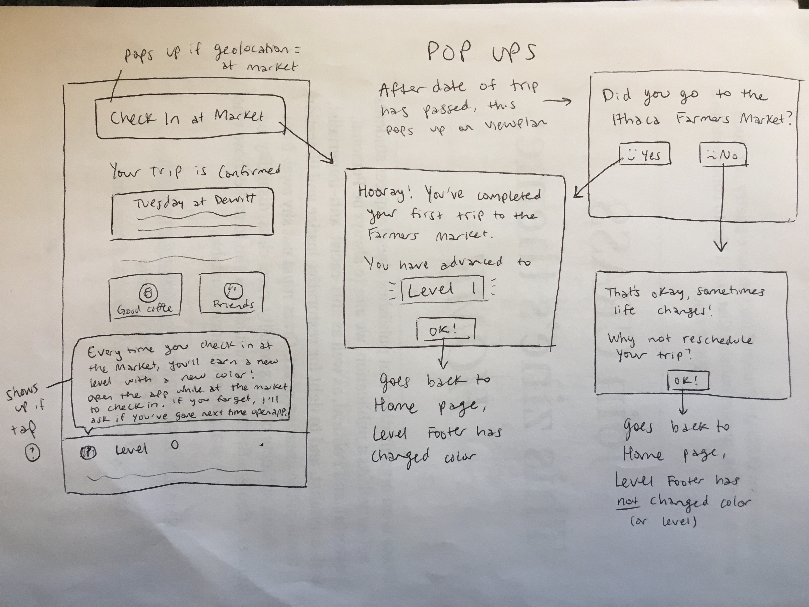

# Blue Magic : Milestone 4
<!-- ## After we re-designed our app. -->

## Final Design
We updated our sketch for a final time, to reflect the design changes that made sense based on informal feedback, and to guide our final styling changes.

This final prototype addresses the user's need to move from wanting to go to the farmers market to actually going in all its functionality. The app allows the user to make a highly personalized plan with all the scheduling and motivation options. The motivations are presented as a second step, so that users can find out all the interesting activities that can be done at the market on their chosen day. Our app presents all the information an infrequent market-goer would want to know, including exciting upcoming events. Our app trusts the intrinsic motivation of the user to want to go to the market, and we provide the gentle push by providing positive feedback at all states (if you did not go to the market, it encourages you to reschedule). The app allows complete control over your schedule using the edit and cancel button (i.e. when needing to reschedule like in our scenario). Our addition of an 'open maps' feature addresses the user's need to find accessible transportation. The app encourages the user to keep going to the market and using our app through its level gamification - every level up gives you a motivational message and sometimes a suggestion for the next visit, and provides exciting discoverability with new colors at each level. 

This app especially fits our persona's needs because it is simple and quick, and does not require constant usage in order to be beneficial. The app trusts the user, and provides options for use and persuasion in all cases (when the user opens the app at the market, or when they open it at a time later, to up the level). Since our persona is generally not aware of all the opportunities at the market, our app displays these in a simple and integrated way. 

Finally, our design is designed for mobile use because our persona is a college student who frequently uses his smartphone, and it's meant to be a quick and simple app that may be opened at the market, so desktop view would not be practical. 

## Planning and Pseudocode

### Schedule

- 11/5-11/8: Make revisions to M3 based on TA/Instructor Feedback
- 11/8-11/12: Create relevant views and components to be used in the app. Create feature branches and divide work among teammates
- 11/12-11/15: Develop out individual features and components of the app prototype
    - e.g. reading a JSON file to generate UI components to represents days at the farmer's market
-11/15-11/19: Work on connecting freatures, merging branches etc.
- 11/19-11/21: Style updates and other quality of life updates

### Pseudocode structure

#### Views
- Home.vue
    - Where the user can navigate through various weeks of events at the farmer's market
- PlanDetails.vue
    - The 'next' page. Page where users can select a motivation for their trip (or go back to home.vue)
- ViewPlan.vue
    - Where the user can see and edit their planned trip to the farmer's market

#### Components
- day panel
    - UI label to represent an individual day at the farmer's market
- day panel
    - UI label to represent a particular motivation to get to the farmer's market

#### Extra files
- events.json
    - Lists out the relevant days at the farmer's market
- motivations.json
    - List of motivations to be shown to the user planning their trip to the farmer's market

## Contributions

- Joe
  - Designed/coded PlanDetails.vue main functionality
  - Designed/Coded ViewPlan.vue main functionality
  - Integrated large amount of functionality/code that connects all 3 views

- Neha
    - Completed initial interviews and value proposition
    - Worked on styling interface, buttons, level colors, and pop up
    - Completed the routing of the application
    - Populated application with Farmer's market data and events

- Nick
    - Built the initial dayPanel and selectedDayPanel components
    - Wrote code to generate dayPanel components using Farmer's market data stored in JSON format

- Zoe
    - Drew final sketches of each iteration of design
    - Designed/coded geolocation functionality
    - Designed/coded all Level Up functionality
    - Worked on revising styling of dayPanel

- Viri
    - Created the motivations file
    - Drafted the second iteration of the design
    - Conducted user tests with the new design 