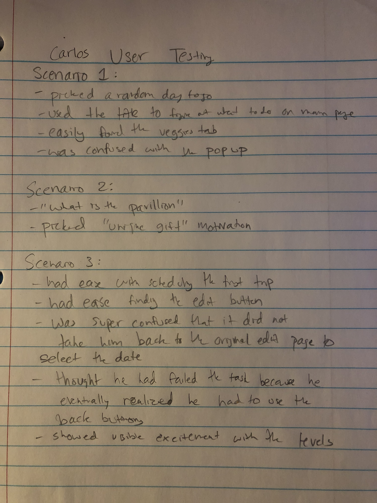

# Blue Magic : Milestone 5

## Evaluation

### Process

Our process for conducting these evaluation sessions was to each meet one on one with someone we had recruited to help us. Each team member took responsibility for finding one willing friend or classmate to assist with the project. We employed the 'think aloud' method to elicit meaningful pieces of feedback from each participant.

Each scenario was evaluated on the degree to which each evaluation session participant was able to complete the given task without any assistance from the person running the session. We paid special attention to moments in the participant hesistated before proceding as it was a sign that some aspect of the design of our app was ambiguous.

### Evidence

[Nick's User Test](userTests/james_evaluation.md)

### Debriefing

- Our team met **in person** in Mann library to discuss what we had found from our evaluation sessions
- Our procedure was to go in a circle, one after another and list off the notes we had taken during each individual session, going one by one through the scenarios

### Issues raised

- In general, people seemed satisfied with the design of the app. 
- Most people had little to no issues navigating the app and setting reminders.
- One of the bigger issues found during our evaluation sessions was that people were confused by the 'edit' button on the view plan page. As is, the button sends the user to edit their *motivations* specifically, but some people thought the button would send them back to main page.
- Another thing to consider was how our app communicated the nature of the leveling system. Some people weren't sure how the leveling system worked, so we considered some ways of improving the language used on the home page of the app.
- Another point of confusion was the popup that appears when the user selects a date that has already occurred and goes through the rest of the app. The 'did you make it to the farmers market' pop up only appears because the code is set to recognize when an event has occurred in the past, and this aspect of the programming was not apparent to people using the app.

## Contributions

- Joe
  - Designed/coded PlanDetails.vue & ViewPlan.vue (did not do modal/level up feature)
  - Completed initial interviews
  - Filled in problems section of action-items.md
  - Integrated large amount of functionality/code that connects all 3 views

- Neha
    - Completed initial interviews and value proposition
    - Worked on revision of previous milestone documentation
    - Worked on styling interface, buttons, level colors, and pop up
    - Completed the routing of the application
    - Populated application with Farmer's market data and events

- Nick
    - Built the initial dayPanel and selectedDayPanel components
    - Wrote code to generate dayPanel components using Farmer's market data stored in JSON format
    <!-- - Updated the persona from milestone 2 -->
    - Worked on re-deploying updated styling code from the master branch to the heroku app
    - Updated app icon to be compatible with 'apple-touch-icon,' 'favicon,' 'android-chrome; formats
    - Ran evaluation session of the final app

- Zoe
    - Completed initial interviews and scenarios
    - Drew final sketches of each iteration of design
    - Designed/coded geolocation functionality
    - Designed/coded all Level Up functionality
    - Worked on revising styling of dayPanel
    - Coded some buttons (switch week data on Home and open directions on ViewPlan)
    - Worked on revisions of milestones

- Viri
    - Created manifest.json file
    - Created icons for deployment
    - Depoloyed PWA
    - Continued to update deployed PWA to reflect changes on the master branch
    - Worked on revision of the updated Milestone 3
