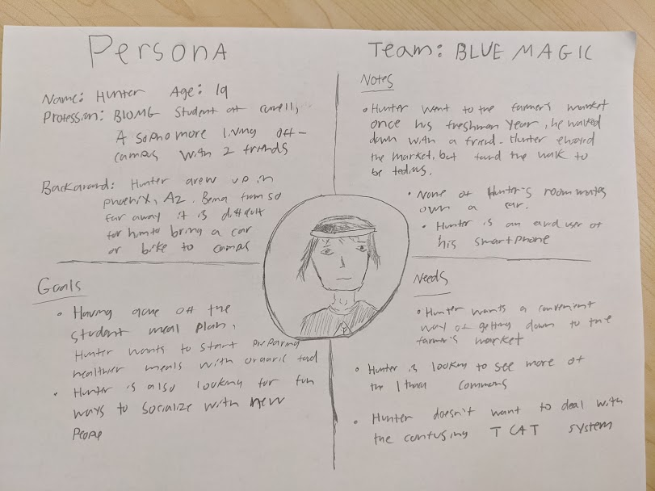

# Blue Magic: Milestone 2

## Information Gathering

This group utilized a series of contextual interviews and casual forms of design ethnography to understand peoples’ process of getting to and experiencing the Ithaca farmer’s market. Specifically, our group used a structured interview procedure to obtain data from our users. Before interviewing, we all contributed to a document that contained a series of questions in which we crafted to best discover various problems and key information. We used structured interviews in order to get consistent data, so that we can aggregate this information and compare results. 

## Interview Process

Contextual interviews occurred at the Ithaca Farmers Market and on Cornell’s campus. Interviews typically had one note taker and one interviewer or one interviewer taking notes simultaneously. We did 10 interviews collectively.

An example of interview jottings can be seen below

## Interview Summary

#### Interview 1

- Interviewer: Zoe R
- Note Taker: Nick M
- Participants: Two Adults in their mid 20’s, both locals to the Ithaca area (one Ithaca, the other Trumansburg NY)
- Interview Notes: [here](interviews/farmers.md)
- Key motivations: community engagement/supporting local farmers
- Key barriers: living too far away, annoying when busy

#### Interview 2

- Interviewer: Neha R
- Participant: Senior Cornell student
- Interview Notes: [here](interviews/caroline.md)
- Key motivations: wanted to see what the hype was all about
- Key barriers: transportation, not knowing what was there

#### Interview 3

- Interviewer: Zoe R
- Note Taker: Nick M
- Participants: Two Adults in their mid 20’s, both Cornell Grad Students, one male one female
- Interview Notes: [here](interviews/grad-students.md)
- Key motivations: getting groceries
- Key barriers: none

#### Interview 4

- Interviewer: Joe M
- Participants: Senior cornell student
- Interview Notes: [here](interviews/andrew.md)
- Key motivations: Going with friends
- Key barriers: Lack of transportation

#### Interview 5

- Interviewer: Joe M
- Participants: Senior cornell student
- Interview Notes: [here](interviews/elsa.md)
- Key motivations: good pictures and food
- Key barriers: money, time

#### Interview 6

- Interviewer: Viri G
- Participant: 42 year-old Cornell employee
- Interview notes: [here](interviews/keith.md)
- Key motivations: Vegetables/ Produce
- Key barriers: None

#### Interview 7

- Interviewer: Viri G
- Participant: 30 year old Cornell employee
- Interview notes: [here](interviews/hugh.md)
- Key motivations: Fresh food
- Key barriers: Parking, traffic

#### Interview 8

- Interviewer: Nick M
- Note Taker: Zoe R
- Interview notes: [here](interviews/acapella-girls.md)
- Participants: Four Ithaca College undergrad students in a capella group, came to perform
- Key motivations: singing for performance, food, ambiance, occasional fun thing to do
- Key barriers: transit and driving, need car and even so hard to find parking

#### Interview 9

- Interviewer: Zoe R
- Participant: Senior Cornell student who lives on campus
- Interview notes: [here](interviews/sophie.md)
- Key motivations: Events, friends want to go
- Key barriers: Expensive, cash only

#### Interview 10

- Interviewer: Nick M
- Note Taker: Zoe R
- Participant: Cornell agriculture student
- Interview notes: [here](interviews/ag-student.md)
- Key motivations: Works here, family runs farm, getting food
- Key barriers: Nothing really

### Executive Summary

Based on these 10 interviews we realized that the main motivations amongst all our participants included food, friends, and the environment. We also realized that the main barriers/ painpoints of the experience include transportation, busyness, and not fully aware what the market includes. People who were at the market often had an existing connection to the Market, and those who came less frequently cited not having the time or energy to plan trips. We documented this better in our affinity diagram.

## Affinity Diagramming

We first wrote down important takeaways from our interviews and arranged them onto a board into categories of barriers, motivations, and miscellaneous
[Sticky Notes](m-2_images/m2-initial-diagram.JPG)

We then organized these information into categories to get a better idea of the patterns found between interviews.

- [Overall Diagram](m-2_images/m2-affinity-diagram.JPG)
- [Barriers](m-2_images/m2-barriers.JPG)
- [Motivations](m-2_images/m2-motivations.JPG)
- Miscellaneous could be categorized into info about [Alternative Transport](m-2_images/m2-alt-transport.JPG)

## Problem

Initial problems we pointed out that are still relevant:

- Transportation
  - Many if not all of our users had obstacles regarding transportation and found it to be one of the maininconveniences with the Farmer's Market. During our information gathering, we found that the main barrier users experienced with the Farmer's Market was not necessarily during there time there, but rather was actually physically traveling to the market. Moreover, for those who drove to the market, parking also seemed to be an issue during peak hours, which we thought went hand in hand with transportation as a whole. In addition, traveling to the market without a car seemed to be an even bigger hassle, as our users were frustrated with confusing bus routes, lack of ubers, expensive ubers, and time constraints that made going to the market not as favorable.

- Time
    - people find it difficult to find the time to come to the market in their busy lives. Oftentimes people cited transportation as an issue, and this is because it takes too much time and effort to figure it out. Going to the market is often not on the forefront of people's minds.

Final problem statement:
Most of these problems we found in user interviews relate to the issue of transportation and navigation. However, upon further consideration into the Market visitors' real needs and motivations, we came to the conclusion that those who were already at the market must have had some intrinsic motivations to overcome these barriers and come to the market. Once at the market, there were little complaints. However, the real issue comes in motivating people to actually go to the market once the intention is there. 

- Thus, the PROBLEM we would like to address is the lack of motivation to take the step from THINKING ABOUT/WANTING to go the Farmers Market to actually GOING. 

## Value Proposition

Compared to Ithaca Farmers Market website, Reminder and Calendar applications, our solution:
- Is customizable to each individual based on real events and data from the market
- Acts as a companion to the individual, rather than a task manager
- Involves levels to incentivize users to use the app again and provide positive reinforcement for accomplishing their goal
- Uses geolocation capabilities to personalize the experience of the user in terms of accomplishing their goal
- Provides as a constant positive reminder with all information needed in one place

Costs and barriers:
- Does not integrate with other calendar tools so requires the use of only this platform
- If the user wants more extensive information of the Farmer's Market, would need to use the Ithaca Farmers Market website

## Scenarios

- You expressed interest to a friend in making a recipe that requires many kinds of fresh vegetables, and they suggested going to the farmer's market to buy them. You are interested in trying this out, and want to make sure you remember to go for this purpose.

- You want to go to find a unique gift for your mom, but you are very busy for the next few weeks and want to see if there are any weekdays where there is a farmer's market day you can get non-food items.

- You scheduled yourself to visit the farmer's market this weekend, but a friend invited you to go to Syracuse instead, so you want to reschedule your visit for the following weekend.

## Persona

Our persona is an undergraduate student named Hunter, a sophomore from AZ studying Biomedical Engineering.

Hunter works hard in school, but is a procrastinator and sometimes lazy, he likes playing video games for fun. He is independent and doesn’t really like when people or systems tell him what to do. He wants to get into cooking more, especially with healthy organic food, but hasn’t had the time. He also loves spending time with friends, and enjoys meeting new people.

Hunter went to the farmers market once with an RA group his freshman year. He hasn’t been since because going that far off campus rarely crosses his mind, and when it does, it seems overwhelming because he doesn’t have much knowledge about his schedule. One of his professors has recently mentioned how great the farmers market is, and Hunter is now thinking about going to the market, but is unsure whether it’s really worth the trouble. What can he even do besides pick up expensive broccoli anyway?

Hunter is savy to most web technology, but doesn't yet have a strong handle on productivity and productivity software. Hunter lives off-campus with 2 roomates, close to downtown ithaca.  Hunter wants to visit the market because he has heard it is fun and a good way to get fresh vegetables.

